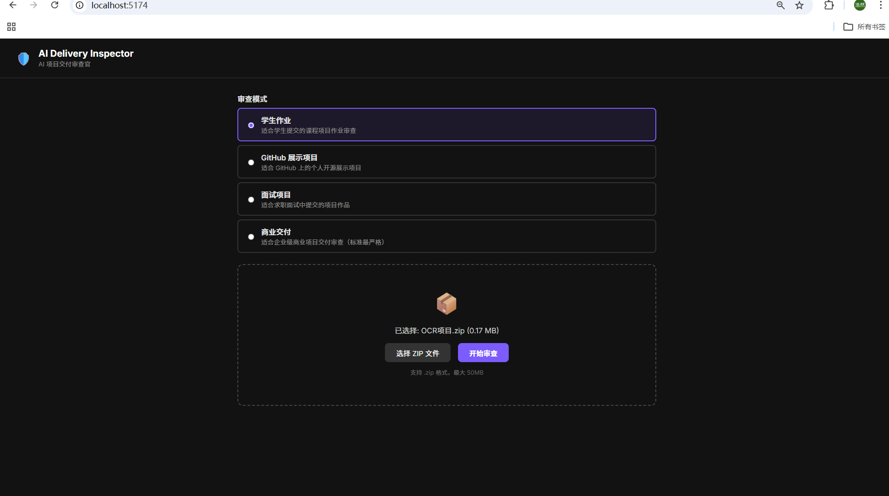
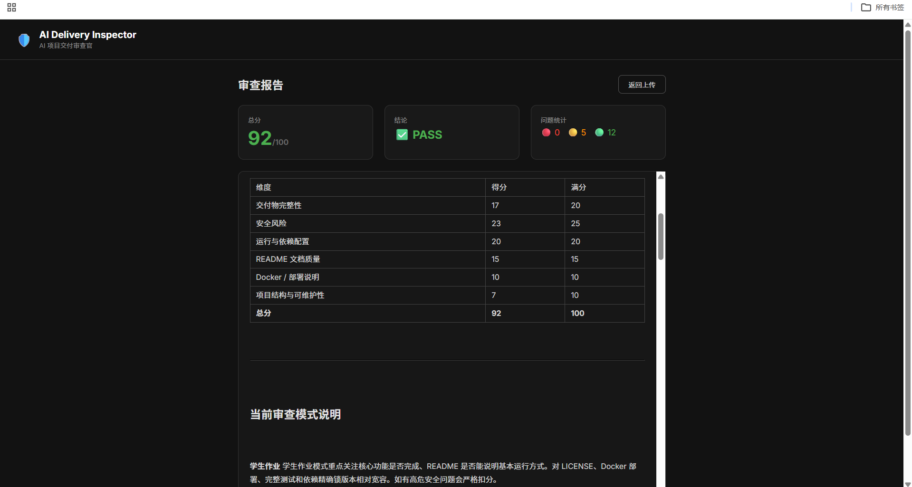
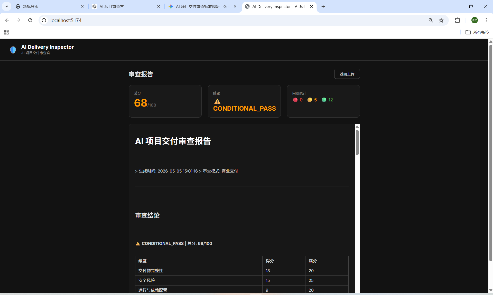
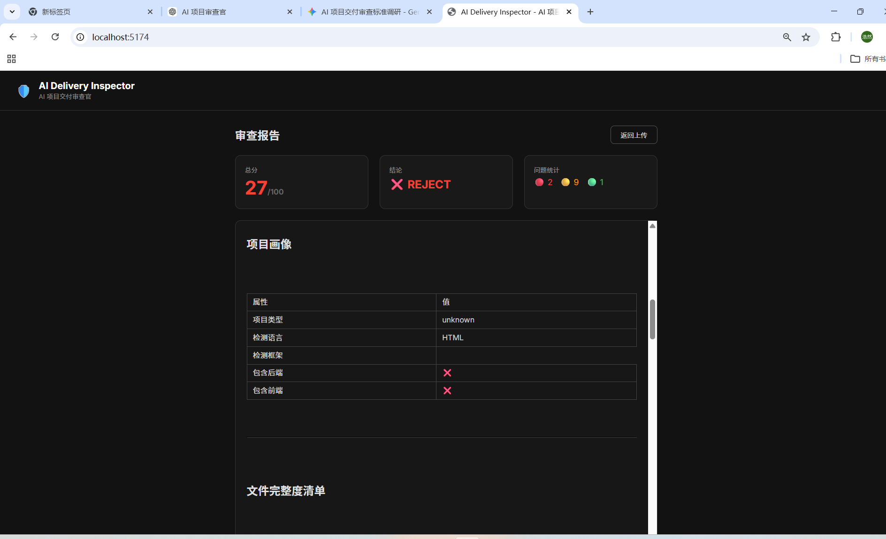

# AI Delivery Inspector — AI 项目交付审查官

自动审查 AI 项目源码的交付完整性、安全风险和文档质量的智能系统。

## 功能

- 上传项目 ZIP 包，自动解析项目结构
- 四种审查模式：学生作业、GitHub 展示、面试项目、商业交付
- 多维度审查：交付完整性、安全风险、依赖配置、README 文档、部署材料
- 自动生成 Markdown 审查报告
- 基于 LangGraph 的工作流引擎，支持后续扩展 LLM 节点

## 项目截图


*上传首页 — 支持四种审查模式选择和拖拽上传 ZIP 文件*


*学生作业模式 — 同一项目得到较高分数和 PASS 结论，对部署材料和 LICENSE 相对宽容*


*商业交付模式 — 同一项目得到更严格的评分和 CONDITIONAL_PASS，安全与部署扣分更重*


*高风险/缺材料项目 — 被判定为 REJECT，检出高危安全问题和多个文件缺失*

## v0.1.1 更新亮点

- **四种审查模式不再只是 UI 展示项**：`review_mode` 会真实影响评分权重、扣分规则、阈值和 verdict。
- **评分规则差异化**：`commercial_delivery` 对安全、部署、测试、依赖锁定的扣分明显比 `student_assignment` 更严格；`interview_project` 对测试覆盖和依赖管理有更高要求；`github_showcase` 更关注 README 和 LICENSE 完整性。
- **判定阈值不同**：`student_assignment` PASS 阈值为 65，`commercial_delivery` 为 82，同一项目在不同模式下可能得到不同的 verdict。
- **安全上限规则**：`commercial_delivery` 模式下存在任何 HIGH 安全问题都不能获得 PASS 结论。

## 技术栈

- **后端**: Python + FastAPI + LangGraph
- **前端**: React + Vite + TypeScript
- **数据库**: 第一版无需数据库

## 环境要求

- Python 3.10+
- Node.js 18+

## 安装与运行

### 后端

```bash
cd backend
pip install -r ../requirements.txt
python main.py
```

后端默认运行在 http://localhost:8000

### 前端

```bash
cd frontend
npm install
npm run dev
```

前端默认运行在 http://localhost:5173

## 配置

复制 `.env.example` 为 `.env` 并根据需要修改配置：

```bash
cp .env.example .env
```

## API 接口

### POST /api/review

上传项目 ZIP 包进行审查。

**参数:**
- `file`: ZIP 文件
- `review_mode`: 审查模式（student_assignment / github_showcase / interview_project / commercial_delivery）

**返回:** Markdown 格式审查报告

## Docker 部署

```bash
docker-compose up --build
```

## 许可证

MIT
